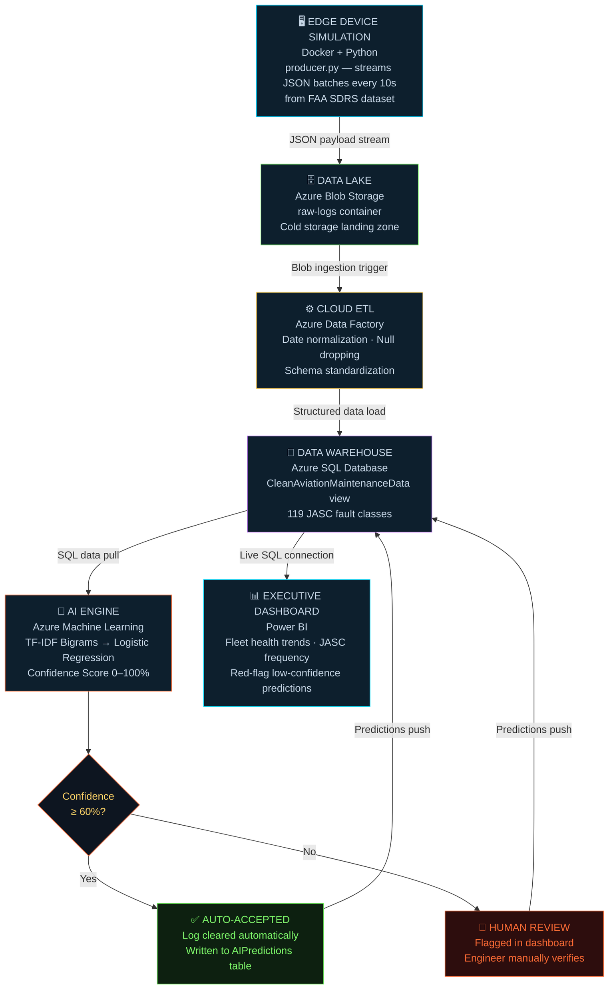
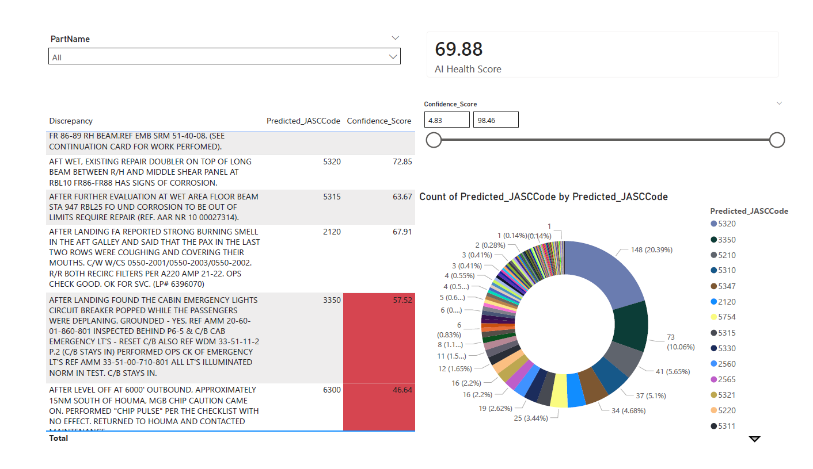

# ✈️ Aviation Maintenance NLP: Automated Fault Classification Pipeline

> Classifies industrial fault reports from free-text maintenance logs using **Azure ML + NLP**

---

## 📋 Table of Contents

- [Problem Statement](#1-problem-statement)
- [Solution Architecture](#2-solution-architecture)
- [Dataset & Preprocessing](#3-dataset--preprocessing)
- [Model Performance](#4-model-performance)
- [Real Examples: Input → Output](#5-real-examples-input--output)
- [How to Run](#6-how-to-run)
- [Business Impact](#7-business-impact)

---

## 1. Problem Statement

In the aviation and manufacturing sectors, mechanics and technicians log maintenance issues using **unstructured, free-text descriptions**. This creates a massive bottleneck: human engineers must manually read thousands of logs to assign standardized **JASC (Joint Aircraft System/Component) codes** before work orders can be routed.

This pipeline automates the classification of unstructured discrepancy logs from the **FAA Service Difficulty Reports (SDRS)**, instantly mapping messy text to standard fault codes with attached **confidence scores** to maintain a _"Human-in-the-Loop"_ safety standard.

---

## 2. Solution Architecture

This project implements a complete, end-to-end **Connected Industry 4.0** data pipeline:



### Layer Summary

| Layer | Component | Description |
|---|---|---|
| 🖥️ **Edge** | Docker + Python | `producer.py` simulates live edge telemetry by sampling raw FAA SDRS data and streaming JSON batches every 10 seconds |
| 🗄️ **Data Lake** | Azure Blob Storage | Landing zone catching streaming JSON payloads in a `raw-logs` container |
| ⚙️ **ETL** | Azure Data Factory | Ingests raw blobs, standardizes date formats, drops null records, and loads structured data into the database |
| 🏢 **Data Warehouse** | Azure SQL Database | Hosts raw telemetry and serves a clean curated view (`CleanAviationMaintenanceData`) optimized for ML |
| 🤖 **AI Engine** | Azure Machine Learning | Pulls SQL data, vectorizes text via TF-IDF, classifies logs with Logistic Regression, and pushes predictions + confidence scores to `AIPredictions` table |
| 📊 **Dashboard** | Power BI | Connects to Azure SQL to visualize fleet health trends and flags low-confidence predictions for human review |

---

## 3. Dataset & Preprocessing

The model is trained on the real-world **FAA Service Difficulty Reports (SDRS)**, which contains historical aircraft malfunction records.

**Dataset Split:**
- 🟢 Training: **580 rows**
- 🔵 Testing: **146 rows**

**Features:**

| Role | Field | Description |
|---|---|---|
| Input | `Discrepancy` | Unstructured mechanic notes including abbreviations, part numbers, and misspellings |
| Target | `JASCCode` | Standardized 4-digit system component code spanning **119 unique classes** |

**NLP Preprocessing — TF-IDF Vectorizer Configuration:**

```python
TfidfVectorizer(
    stop_words='english',   # Strip standard English stop words
    ngram_range=(1, 2),     # Capture bigrams
    max_features=2500,      # Expand vocabulary
    min_df=2                # Ignore ultra-rare typos
)
```

---

## 4. Model Performance

**Logistic Regression** (`max_iter=2000`, `C=10`) outputs both a predicted fault class and a **Confidence Score (0–100%)**.

> ⚠️ Logs scoring **below 60%** are automatically flagged for manual review.

| Metric | Score |
|---|---|
| Baseline AI Accuracy | 45.89% |
| **Upgraded AI Accuracy** | **67.12%** |
| Average Fleet AI Health | 69.88% |

---

---

## 5. Real Examples: Input → Output

### ✅ Example 1: The Confident Automation

**Raw Input:**
```
AFTER LANDING FA REPORTED STRONG BURNING SMELL IN THE AFT GALLEY AND SAID THAT 
THE PAX IN THE LAST TWO ROWS WERE COUGHING... R/R BOTH RECIRC FILTERS PER A220 AMP 21-22.
```

| Field | Value |
|---|---|
| Predicted JASC Code | `2120` |
| Confidence Score | `67.91%` |
| Action | ✅ **Auto-accepted** — Confidence > 60%, log cleared without manual intervention |

---

### ⚠️ Example 2: The "Human-in-the-Loop" Edge Case

**Raw Input:**
```
FOUND MAJOR CORROSION AND HUGE CRACKS ON THE LEFT LANDING GEAR DOOR IN THE FWD CARGO AREA.
```

| Field | Value |
|---|---|
| Predicted JASC Code | `5320` |
| Confidence Score | `12.18%` |
| Action | 🔴 **Flagged for review** — Dashboard highlights row in red, alerting an engineer to manually verify |

---

## 🛠️ Tech Stack


- **Cloud:** Azure Blob Storage, Azure Data Factory, Azure SQL Database, Azure Machine Learning
- **ML:** Logistic Regression, TF-IDF Vectorization (scikit-learn)
- **Edge Simulation:** Python, Docker
- **Visualization:** Power BI
- **Dataset:** FAA Service Difficulty Reports (SDRS)

---

## 6. How to Run

### 1. Start the Edge Data Stream (Docker)

Ensure Docker is installed, then build and run the data producer:

```bash
docker build -t aviation-edge-node .
docker run -e AZURE_CONNECTION_STRING="DefaultEndpointsProtocol=https;AccountName=YOUR_ACCOUNT_NAME_AND_KEYS_HERE" aviation-edge-node
```

### 2. Azure Setup

- Trigger your **Azure Data Factory** pipeline to move the generated JSON blobs from the `raw-logs` container into your Azure SQL database.
- Execute the SQL script provided to generate the `CleanAviationMaintenanceData` view.

### 3. Train & Score the Model

Open the **Azure ML workspace**, configure your database credentials, and run `nlp_model.ipynb` to generate predictions and push them back to the database.

### 4. View the Dashboard

Open `Aviation Fault Classifier.pbix` in **Power BI Desktop** and click **Refresh** to pull the live AI predictions from your Azure SQL instance.

---

## 7. Business Impact

In the context of Connected Industry 4.0, shifting from reactive repairs to predictive maintenance requires massive amounts of structured historical data. Unstructured text logs are a **dark data asset** — they contain the ground truth of machine failure but cannot be read by digital twins or forecasting algorithms.

By deploying a containerized NLP pipeline to standardize this text into machine-readable fault codes at scale, organizations can:

- **Unlock years of legacy data**, making it available for predictive model training
- **Reduce Aircraft On Ground (AOG) downtime** through faster, automated fault triage
- **Optimize the spare parts supply chain** with structured, queryable failure history

> This directly accelerates the transition from legacy maintenance logs to a fully data-driven, predictive fleet management system.

---
## 👨‍💻 Author
Alireza Sorousheh
---

*Maintained for aviation safety research and industrial NLP classification.*
